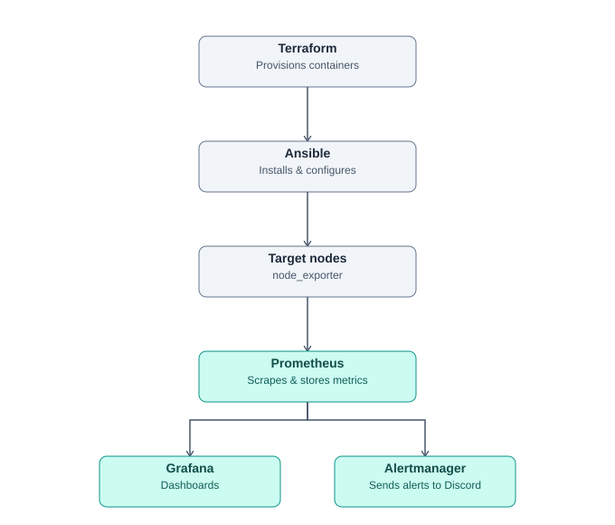
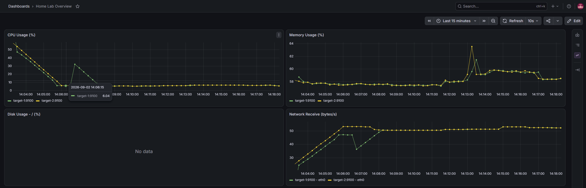
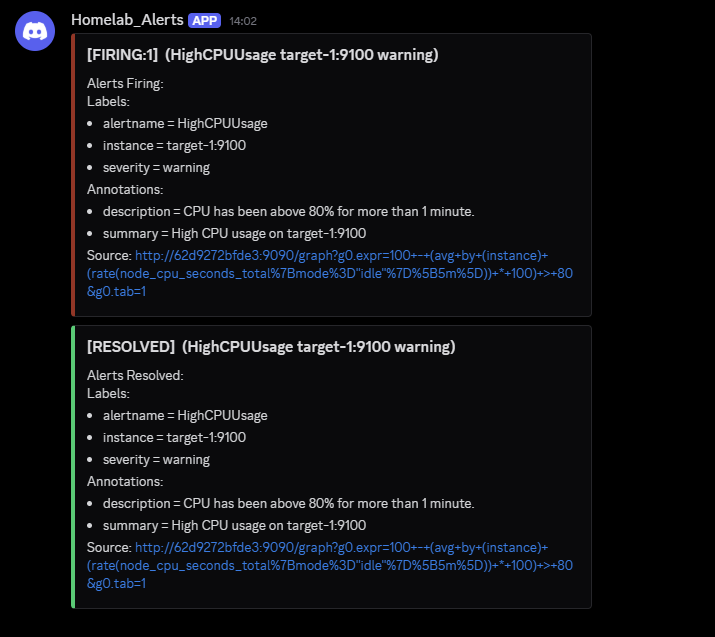

# Home Lab Infrastructure Automation

Self-hosted observability stack for a home lab, fully automated end-to-end —
provisioning, configuration, monitoring, and alerting — with a single command.
No manual clicking anywhere in the pipeline.

## Architecture



| Layer | Tool | Role |
|---|---|---|
| Provisioning | Terraform | Creates simulated servers (systemd-enabled containers) |
| Configuration | Ansible | Installs & enables node_exporter on every target |
| Metrics | Prometheus | Scrapes host metrics every 15s |
| Visualization | Grafana | Auto-provisioned dashboard (CPU/RAM/Disk/Network) |
| Alerting | Alertmanager | Sends real-time alerts to Discord |

## Quick Start

```bash
git clone https://github.com/kimkimono8/homelab-infra-monitoring.git
cd homelab-infra-monitoring
./deploy.sh
```

Then open:
- Grafana: http://localhost:3000 (admin/admin)
- Prometheus: http://localhost:9090
- Alertmanager: http://localhost:9093

## Tear Down

```bash
./destroy.sh
```

## Screenshots




## Tech Stack

Terraform · Ansible · Docker · Prometheus · Grafana · Alertmanager
